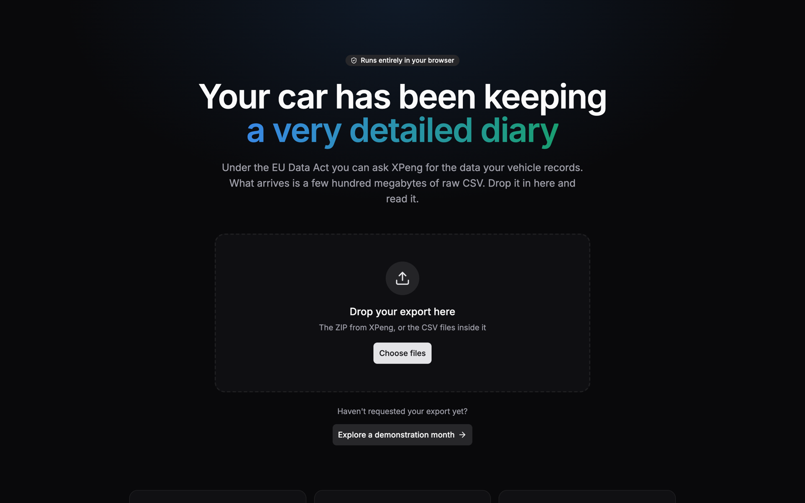
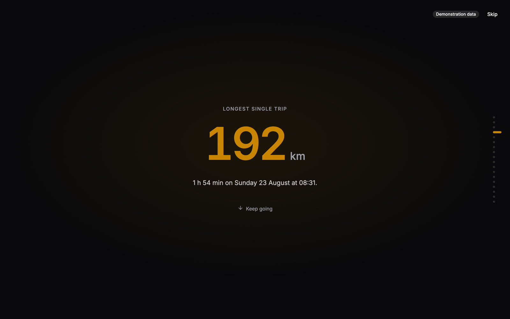
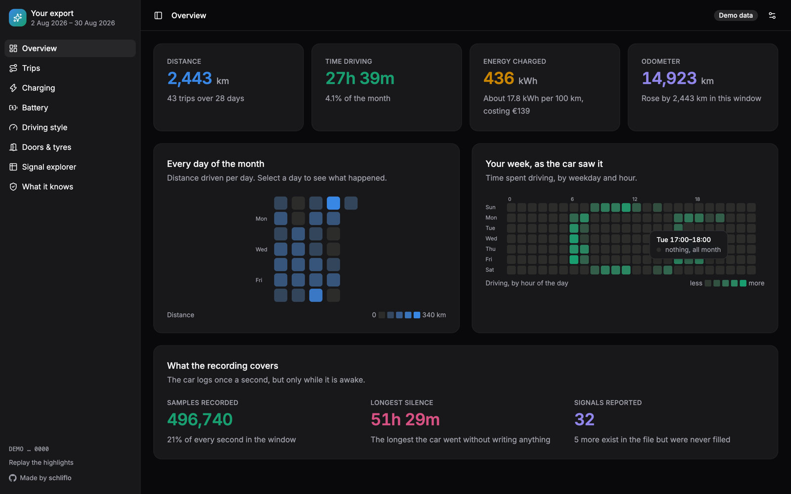
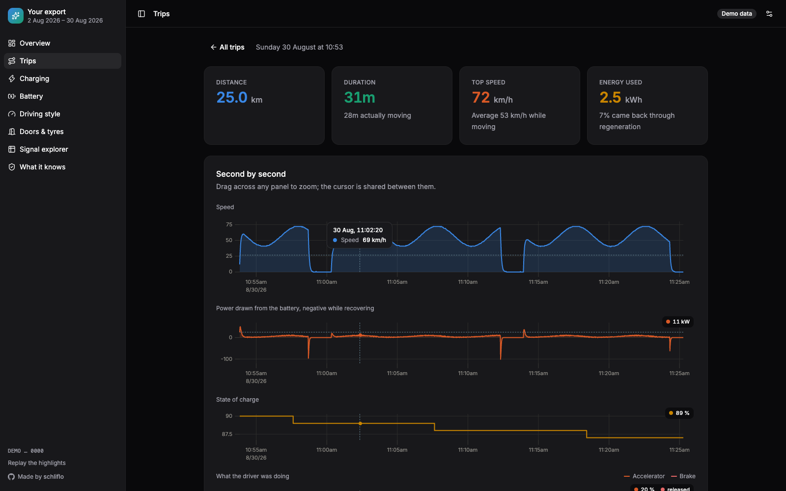
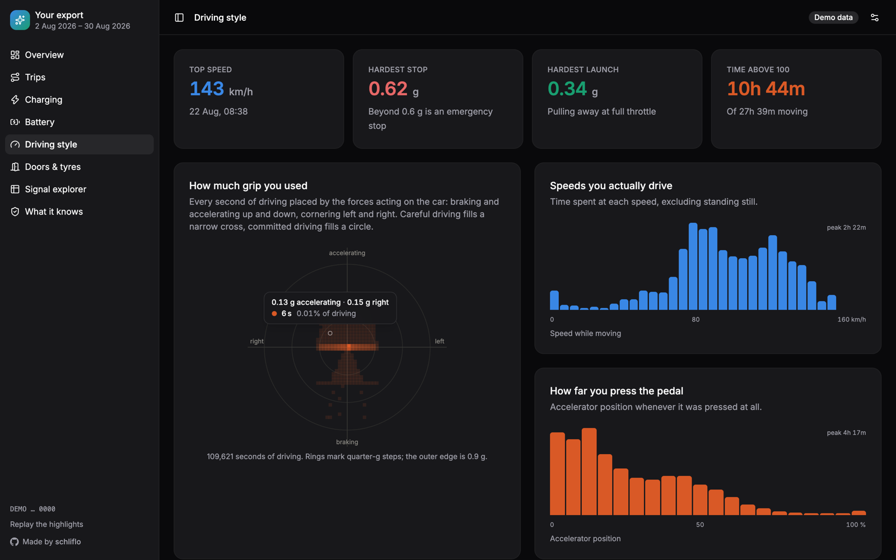
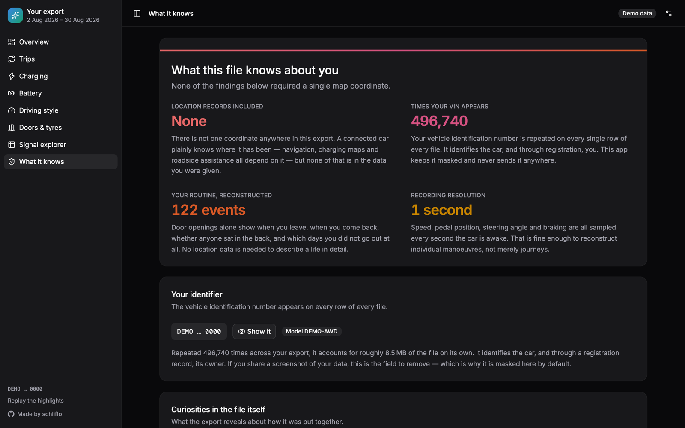

# XPeng Data Export Browser

An interactive reader for the vehicle data XPeng gives you under the EU Data
Act. Drop in the export, and it becomes trips, charging sessions, battery
behaviour, driving style, and a plain account of what the file reveals about
your daily life.

Everything runs in the browser. There is no server to send anything to: the app
is a set of static files, the export is parsed by a worker inside the page, and
closing the tab discards it.

## What it looks like

All screenshots use the built-in demonstration month, so no real vehicle
appears in them.



The export never leaves the page. Drop the files in, or explore a generated
demonstration month first.



Parsing ends in a full-screen sequence of the month's findings, one per screen —
the things you would not have thought to ask for.



Then the dashboard. Every chart names the point under the pointer; here the
punchcard is reporting an hour the car never once moved in.



A trip second by second. Hovering any panel reads out that instant in all of
them, so one moment can be read across speed, power and state of charge at once.



Every second of driving placed by the forces on the car. Cautious driving fills
a narrow cross; the outer rings are where grip runs out.



And a plain account of what the file gives away — none of which needed a single
map coordinate.

## Getting your data

Request it from [xpeng.com/data-act](https://www.xpeng.com/data-act). You
receive CSV files named like:

```
DA<request-id>_dwd_opp_gdpr_veh_driving_status_di.csv
DA<request-id>_dwd_opp_gdpr_veh_driving_operation_di.csv
DA<request-id>_dwd_opp_gdpr_veh_driving_power_energy_di.csv
```

Each stream is capped at a million rows, so anything longer spills into
`_part1`, `_part2` and so on — note that the file _without_ a suffix is the
earliest one. Drop the whole set in, or the ZIP as downloaded.

The export covers a rolling thirty days at one sample per second while the car
is awake, which comes to roughly 340 MB and 3.6 million rows.

## Running it

```sh
pnpm install
pnpm dev          # http://localhost:5173
```

Without an export of your own, click **Explore a demonstration month** — a full
synthetic month is generated in the browser, with commutes, a weekend trip and
a rapid-charging stop.

```sh
pnpm test         # unit tests
pnpm check        # types
pnpm build        # production build
```

## Working offline

After the first visit the app opens without a connection. A service worker
stores the app's own files — scripts, styles, fonts, icons and pages, about
1.5 MB in all — when it installs, and serves them from that store from then
on. The export is never stored: what is kept is the app, not anything dropped
into it, and closing the tab still discards the data. The browser's menu can
also install it as an app, which opens it in a window of its own.

A new deployment installs quietly in the background and waits. The page then
offers a reload, and nothing happens until you take it: a page that restarted
on its own would throw away the export it holds.

Trying it needs a production build, since the dev server serves everything
live:

```sh
pnpm build
pnpm preview      # http://localhost:4173
```

Open it once, then stop the server — or set the browser's network panel to
offline — and reload.

## Deploying to Cloudflare Workers

Every route is prerendered and there are no server routes, so the Worker only
serves static assets.

```sh
wrangler login
pnpm build
wrangler deploy
```

Set `PUBLIC_SITE_URL` at build time so the pages can name themselves:

```sh
PUBLIC_SITE_URL=https://your-domain.example pnpm build
```

It fills in the canonical link, `og:url`, the absolute social-image URL and the
`Sitemap:` line in `robots.txt`. Without it those are simply left out and the
social image is referenced by path, which every major link-preview scraper
resolves against the page it found it on — so the build works either way.

## What the app works out for itself

Nothing in the export is labelled: there are no trips, no charging sessions and
no summary of any kind, only raw signals. These are derived:

- **Trips** — from gear position and odometer movement, ending once the car has
  been parked a while, so a wait at a traffic light does not split a journey.
- **Charging sessions** — from the plug's power signal, joined across the naps
  the car takes mid-charge. Regeneration never appears there, so charging and
  braking are never confused.
- **Energy** — integrated from pack voltage and current, which separates energy
  drawn from energy recovered.
- **Charge limit and charging schedule** — from where charging repeatedly stops
  of its own accord, and when it repeatedly starts. Both are reported only when
  the evidence is there; a car that charges to full has no limit to report.
- **Standby drain** — from charge lost across long parked periods.
- **Real full-charge range** — from the car's own prediction, extrapolated.

## Notes on the data

A few things about the format are worth knowing, and the app handles all of
them:

- Every file begins with a byte-order mark, and every row repeats the VIN.
- Rows carry a date column alongside the timestamp, but it is cut at midnight
  in Beijing — early evening in central Europe. Grouping by it would put an
  evening drive on the next day, so it is ignored and days come from the
  timestamps in your own timezone.
- Signals use unscaled "not available" codes rather than blanks: speed reports
  255, range 1638.3, battery temperature 215. Left in, they wreck every chart.
- A few thousand rows per file arrive twice, and at least one real export has a
  block of an earlier day written after a later one. Rows are sorted and
  de-duplicated before anything is measured.
- Several columns exist in every row and are never filled — window positions
  and the tailgate on this model, the front motor on a rear-drive car. They are
  detected and hidden rather than drawn as empty charts.
- There is no location data anywhere in the export.

## Layout

```
src/lib/data/
  schema/      column registry — units, sentinels, storage type, labels
  parse/       streaming CSV reader, ZIP, ordering, stream alignment
  store/       columnar storage and the min/max pyramid the charts read
  analytics/   trips, charging, battery, driving style, doors, facts
  worker/      the worker and its message protocol
src/lib/demo/  synthetic month generator
src/lib/offline/             what the service worker keeps, and how it finds it
src/service-worker.ts        the service worker itself
src/lib/components/charts/   uPlot wrapper, calendar, punchcard, g-g diagram
src/routes/    landing, the opening sequence, and the dashboard sections
src/lib/seo.ts               site metadata, shared by every page
static/                      icons, the social card, the manifest
design/og-card.html          source for the social card; render it at 1200x630
```

The column registry is the piece to edit first: adding a signal there gives it
units, sentinel handling, storage and a place in the explorer. Signals the
registry does not know about are still parsed and still plottable.

## Testing

`pnpm test` covers the parser (byte-order marks, chunk boundaries, duplicates,
part ordering, sentinels), the analytics against hand-built cases with known
answers, the demo generator against the ground truth it was built from, and
what the service worker decides to keep.

If a `.samples/` directory is present it is also checked against a real export
end to end; that directory is git-ignored, because a real export identifies a
real vehicle.

## Licence

MIT — see [LICENSE](LICENSE). Not affiliated with, or endorsed by, XPeng.
